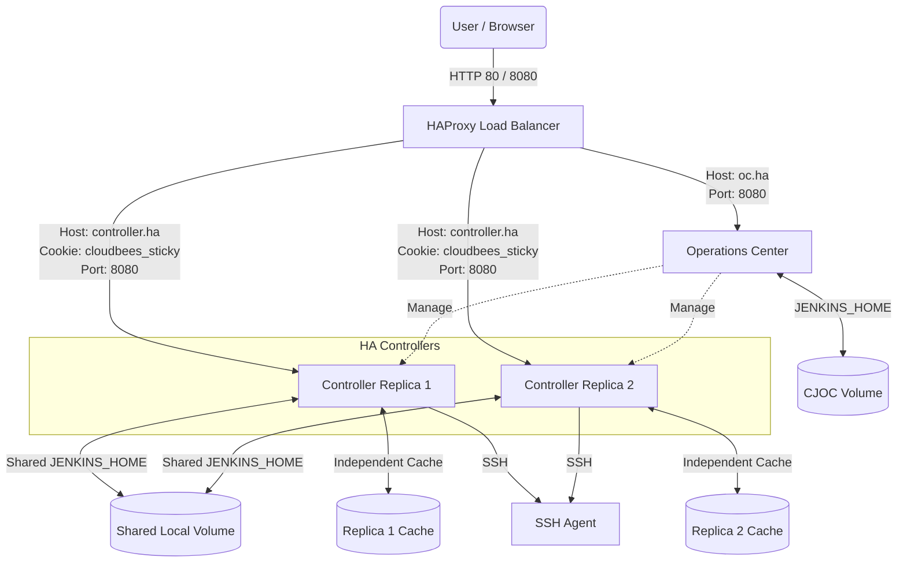
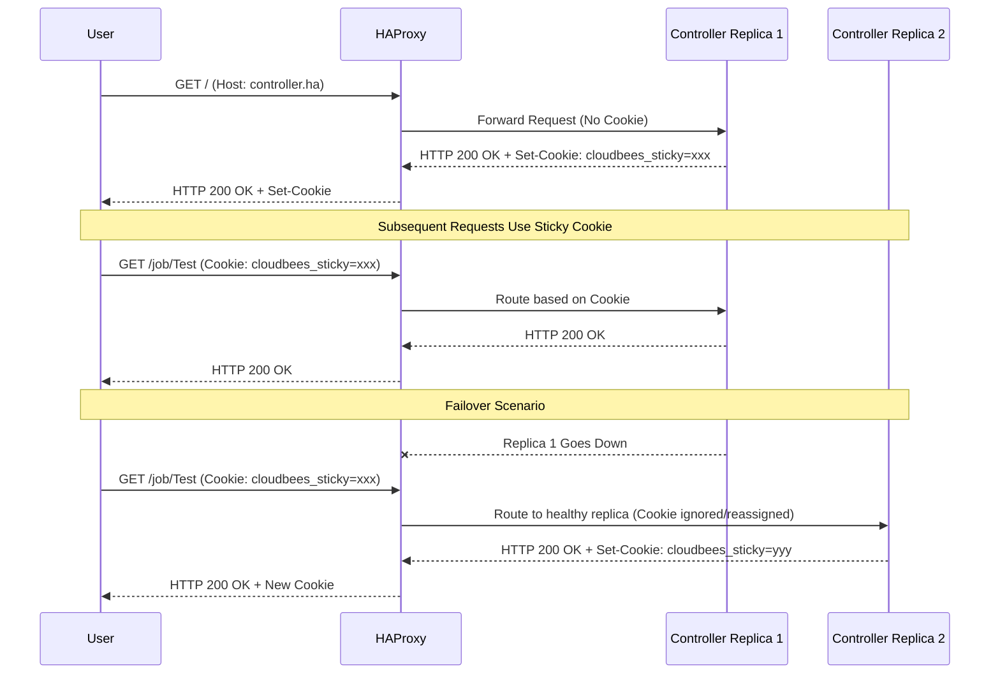

# CloudBees CI Traditional HA (Active/Active) Demo Lab

A complete Docker Compose environment demonstrating a [CloudBees CI Traditional Installation](https://docs.cloudbees.com/docs/cloudbees-ci/latest/traditional-install-guide/) running in [High Availability (Active/Active) mode](https://docs.cloudbees.com/docs/cloudbees-ci/latest/ha/ha-fundamentals).

For more background on CloudBees CI High Availability, review the following resources:

* [HA Fundamentals](https://docs.cloudbees.com/docs/cloudbees-ci/latest/ha/ha-fundamentals)
* [HA Considerations](https://docs.cloudbees.com/docs/cloudbees-ci/latest/ha/ha-considerations)
* [Traditional HA Installation Guide](https://docs.cloudbees.com/docs/cloudbees-ci/latest/ha/specific-ha-installation-traditional)

## Architecture

This demonstration orchestrates CloudBees components and an HAProxy load balancer using Docker Compose. It operates self-sufficiently without requiring configuration on the Docker host, with two exceptions:

1. **Persistence:** Local host directories are mapped as persistent volumes. (NFS is not used in this lab; Controller 1 and Controller 2 share the same `$JENKINS_HOME` directory via a local mount.)
2. **Browser Access:** Hostnames must be resolved either via `/etc/hosts` or by using the included containerized browser (accessible via [http://localhost:3000](http://localhost:3000)).

**Current Limitations:**

* NFS support is not yet implemented. Local directories are used instead.

### HTTP Mode (Port 80 / 8080)



### HTTPS Mode (Port 443 / 8443)


### Request Flow



### Infrastructure Components

The lab features the following containers:

* **HAProxy Load Balancer:** Routes traffic to CJOC and Controllers. Uses `$OC_URL` host header for Operations Center requests and `$CLIENTS_URL` for controller requests (with sticky session balancing).
* **Operations Center (CJOC):** Central management component.
* **Controllers (2x):** Run in HA/HS (Active/Active) mode.
* **SSH-Agent (1x):** Agent container for running pipeline builds.
* **Webtop (Optional):** A containerized Linux desktop with standard web browsers for accessing the lab.

## Prerequisites

The demo has been verified with:

* **OS:** macOS 14.7
* **Docker Desktop:** 4.24.0 (Engine: 24.0.6)
* **Docker Compose:** v2.22.0-desktop.2
* **Browsers:** Firefox, Google Chrome

## Quick Start

1. **Clone the Repository:** Check out the source code to your local machine.
2. **Launch the Lab:**
   * HTTP Mode: `./up.sh`
   * HTTPS Mode: `./up.sh ssl=true`

   *This script scaffolds local volumes, generates SSH keys, renders the Compose file via `envsubst`, and starts all containers. Configuration as Code (CasC) provisions the initial setup.*
3. **Access the Lab:**
   Wait for components to initialize, then choose an access method:
   * **Option A (Browser in a Box):** Navigate to [http://localhost:3000](http://localhost:3000) and launch Firefox. No host configuration required.
   * **Option B (Local Browser):** Add `127.0.0.1 localhost oc.ha controller.ha` to your `/etc/hosts` file and open [http://oc.ha](http://oc.ha).
4. **Log In:** Use `admin / admin` to log into the Operations Center.

You will find a controller running in HA mode with a pre-configured SSH agent and a test pipeline job ready to execute.

## Operations and Maintenance

| Action | Command | Description |
|--------|---------|-------------|
| **Start Environment** | `./up.sh` (or `./up.sh ssl=true`) | Initializes volumes, config, and starts containers. |
| **Stop Environment** | `./down.sh` | Safely stops all containers. |
| **Restart Controllers** | `./restartControllers.sh` | Performs a rolling restart of the HA controllers. |
| **Clean Up** | `./deleteVolumes.sh` | Deletes the docker persistence directories on the host. |

## File Reference

### Configuration & Tooling

* **`.env` and `.env-ssl`:** Contains essential variables (`OC_URL`, `CLIENTS_URL`, image versions, HA parameters). Standard use cases do not require modification.
* **`docker-compose.yaml.template`:** Template used by `up.sh` to render the final `docker-compose.yaml`. **Do not modify `docker-compose.yaml` directly.**
* **`up.sh` / `down.sh`:** Primary utility scripts for lab lifecycle management.
* **`deleteVolumes.sh`:** Hard reset script to drop persistence volumes.
* **`restartControllers.sh`:** Performs managed restarts of the client controllers.
* **`ssl/01-createSelfSigned.sh`:** Generates keys and certificates required for HTTPS mode.

### Load Balancer

* **`haproxy.cfg` / `haproxy-ssl.cfg`:** HAProxy configurations defining frontends, backends, health checks, sticky sessions, and websockets.

### Configuration as Code (CasC)

* **`casc/cjoc/`:** Bundles used to provision the Operations Center on startup.
* **`casc/controller/`:** Bundles to configure the HA controllers (includes HA plugin settings, SSH credentials, agent configs, and standard test jobs).
* **`secrets/`:** Auto-generated directory containing SSH keys injected into Controllers by CasC.

## Manual Configurations (If Not Using CasC)

While CasC automates the configuration, you can perform these steps manually for learning purposes:

1. **Unlock CJOC / Controller:** Retrieve the initial admin password from container logs or via `docker-compose exec [container_name] cat /var/jenkins_home/secrets/initialAdminPassword`.
2. **System Setup:** Install suggested plugins, disable TCP Port 50000, and enforce Security Realm/SSO in CJOC.
3. **Controller Connection:** Create a client controller item in CJOC, ensuring "websocket" is enabled. Push connection details to `http://controller.ha/`.
4. **HA Setup:** Install the CloudBees HA plugin on the controller and restart the replicas.

## Testing High Availability

1. Ensure both controllers are running and verify their status via the HA monitor screen.
2. Trigger the `test/Jenkinsfile-ssh-agent.groovy` pipeline on the controller.
3. Identify which replica is actively running your session (enable HA developer mode to see the info icon at the bottom of the UI).
4. Shut down the active replica: `docker-compose stop ha-client-controller-1` (or `2`).
5. Reload your browser; the operation should seamlessly failover to the healthy replica, and the pipeline will continue execution.

## Troubleshooting

### SSL Certificate Warnings

Because the demo uses self-signed certificates or runs without SSL locally, browsers may show security warnings.

* **Option 1 (HTTPS mode):** Import the self-signed certificate into your OS keychain (e.g., macOS Keychain Access) and set it to "Always Trust".
* **Option 2 (HTTP mode):** Disable "HTTPS Only" mode in your browser's security settings (or add exceptions for `oc.ha` and `controller.ha`).

### DNS Issues (macOS)

If you cannot resolve `oc.ha` or `controller.ha` after modifying `/etc/hosts`, flush the DNS cache:

```bash
sudo dscacheutil -flushcache; sudo killall -HUP mDNSResponder
```

### Inspecting Headers with cURL

To aid in load balancer debugging, use these cURL commands:

```bash
source ./.env
# View Headers Only
curl -u "${CJOC_LOGIN_USER}:${CJOC_LOGIN_PW}" -s -D - ${CLIENTS_URL} -o /dev/null
# Full Response (Verbose)
curl -u "${CJOC_LOGIN_USER}:${CJOC_LOGIN_PW}" -i -v ${CLIENTS_URL} -o /dev/null
# Custom Host Header
curl -u "${CJOC_LOGIN_USER}:${CJOC_LOGIN_PW}" -v -H "Host: custom.example.com" ${CLIENTS_URL} -o /dev/null
```

### Hazelcast Networking

If the active/active nodes fail to pair:

1. Remove `-Dhz.jet.enabled=true` if it appears in JVM arguments.
2. Verify port connectivity between replicas: `nc -vz <CONTROLLER_IP> 5701`.
3. Confirm configured IPs for `-Dhudson.TcpSlaveAgentListener.hostName`.
4. Enable Hazelcast debug logging: add `-Dhazelcast.diagnostics.enabled=true` to JVM options and configure a custom logger for `com.cloudbees.jenkins.plugins.replication.hazelcast.FilesystemDiscoveryStrategy`.

## Resources

* [CloudBees CI Traditional HA Documentation](https://docs.cloudbees.com/docs/cloudbees-ci/latest/ha/specific-ha-installation-traditional)
* [HA Performance Bottlenecks & Tuning](https://www.cloudbees.com/blog/analyzing-cloudbees-ci-high-availability-performance-bottlenecks-and)
* [HAProxy Websocket Load Balancing Configuration](https://www.haproxy.com/documentation/haproxy-configuration-tutorials/load-balancing/websocket/#configure-websockets)
* [LinuxServer.io Webtop Container Documentation](https://docs.linuxserver.io/images/docker-webtop/#lossless-mode)

## Roadmap / TODO

- [ ] Ensure full support and testing on standard Linux distributions.
* [ ] Implement and verify NFS-backed volume sharing.
* [ ] Evaluate replacing `docker-compose.yaml.template` with native [Compose interpolation](https://docs.docker.com/reference/compose-file/interpolation/).
* [x] Enable SSL on HAProxy (Self-signed certificates).
