# CloudBees Ci Traditional HA/HS (active/active) Demo Lab Environment

Docker compose setup for a [Cloudbees CI traditional installation](https://docs.cloudbees.com/docs/cloudbees-ci/latest/traditional-install-guide/) in [HA (active/active) mode](https://docs.cloudbees.com/docs/cloudbees-ci/latest/ha/ha-fundamentals)

See these links for the background

* <https://docs.cloudbees.com/docs/cloudbees-ci/latest/ha/ha-fundamentals>
* <https://docs.cloudbees.com/docs/cloudbees-ci/latest/ha/ha-considerations>
* <https://docs.cloudbees.com/docs/cloudbees-ci/latest/ha/specific-ha-installation-traditional>

# Architecture

The docker-compose setup for the HA/HS demo follows the design below.
Each CloudBees component as well as the HAProxy is running in a dedicated docker container orchestrated by docker-compose.

The demo has the following limitations:

* SSL 443 is not enabled yet. All traffic for local demo is going through port 80/8080
* NFS server is not part of the demo. We will use a local directory on the host system

Two models are supported:

## HTTP  (All traffic plain on HTTP port 80 and 8080)

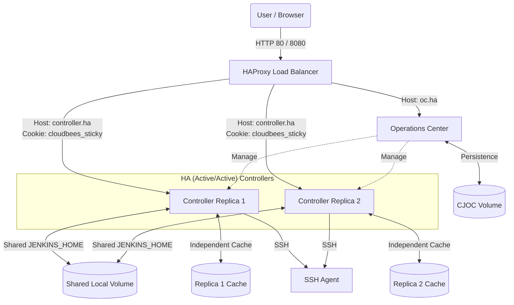

## HTTPS  (All traffic on HTTPS port 443 and 8443)

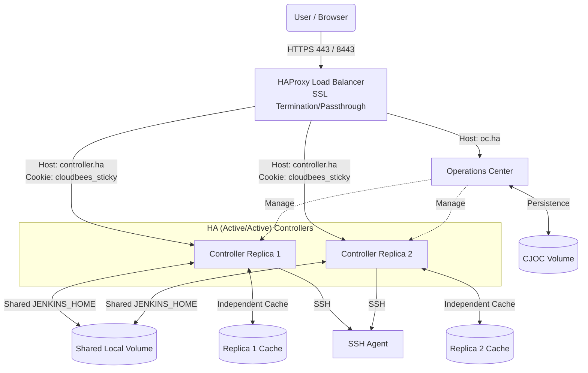

## Request Flow (Sequence)

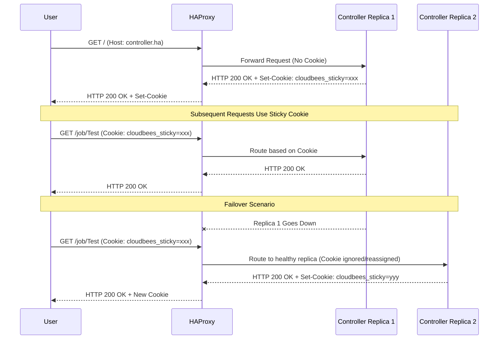

The setup consists of the following containers:

* Operations Center
* Controller 1
* Controller 2
* SSH-Agent 1
* HAProxy Load Balancer
* Optional, but not required: Linux box with Firefox accessible via VNC from an external browser

The setup is self-sufficient and does not require any modifications on the Docker host or anywhere else outside of the docker compose environment.
There are two exceptions to highlight:

* Persistence
  * Local paths on the docker host are used as persistence volumes.  
  * Controller 1 and Controller 2 share the same $JENKINS_HOME dir.
  * NFS volumes are not used at the moment in the demo lab.
* Browser access
  * If you want to access the demo via a browser from a Docker host, you need entries in `/etc/hosts` (see chapters below)
  * If you don't want to add entries in `/etc/hosts`, you can access a browser in a container under [http://localhost:3000](http://localhost:3000). No changes on your Docker host system are required in this case

The Operations Center and both controllers are behind HAProxy.

* If a request comes to HAProxy with $OC_URL host header, it is forwarded to the Operations Center container
* If a request comes with $CLIENTS_URL host header, it is load balanced between all client controllers
* The load balancing for client controllers has sticky sessions enabled

# Pre-requirements

* This demo has been tested
  * on MacOs 14.7
  * Docker-Desktop 4.24.0 (122432)
  * Engine: 24.0.6
  * Compose: v2.22.0-desktop.2
  * Docker-compose v3
  * Web browsers, Firefox and Chrome, have been tested

# Quick Start

* Clone this repository
* Ensure you have an SSH private and public key under the path `~/.ssh/id_rsa` and `~/.ssh/id_rsa.pub`
  * If you don't have an SSH key, run `ssh-keygen -t rsa -f ~/.ssh/id_rsa` to create one
  * The key is required for the agent we want to connect to the HA/HS Controller in this demo
  * If you have your key already under another path or name, adjust it in the `env.sh` configuration file
* Run `up.sh`
  * The related containers will start now. The essential configuration are already setup using Configuration as Code
  * You will get redirected to you browser to the Operations center when all container are up and running. This might take some minutes
* Browser access to the Operations center
  * Option1: Use a Browser in a box: Follow these instructions [Join the containerized browser in a Box](#option1_join_the_containerized_browser_in_a_box)
    * This option doesn't require changes on your host in `/etc/hosts`
  * Option2: Use your Browser on your Machine: Follow these instructions [Use your Firefox/Chrome on your docker host](#option2_use_your_browser_on_your_docker_host)
    * This option require changes on your host in `/etc/hosts`
* Open the Operations Center
  * use `admin/admin` for login
* Request a trial license (first option)
* Click on the pre-provisioned controller "ha" in the Operations Center UI
* Add `http://controller.ha` and click `push configuration` and `join operations center`
* Now you are on a Controller running in HA/HS mode. A test Pipeline job using an SSH agent is already running

# Files

[env.sh](env.sh)

The essential variables are explained here; for detailed settings, take a look at the `env.sh` file.
Usually, you don't need to change something in the env settings

* `OC_URL` is the URL you want the Operations Center to respond on.
* `CLIENTS_URL` is for the controllers. There is only one URL for both controllers.
* `DOCKER_IMAGE_OC` and `DOCKER_IMAGE_CLIENT_CONTROLLER` are the CB CI versions on Operations Center and controllers
* `IP_PREFIX` is a prefix for the internal docker-compose network
* `PERSISTENCE_PREFIX` is the path for the persistence volumes on the docker host
* `CONTROLLER_JENKINS_OPTS` required JENKINS settings for HA/HS  see <https://docs.cloudbees.com/docs/cloudbees-ci/latest/ha/specific-ha-installation-traditional#_jenkins_args>
* `CONTROLLER_JAVA_OPTS` required JAVA settings for HA/HS see <https://docs.cloudbees.com/docs/cloudbees-ci/latest/ha/specific-ha-installation-traditional#_java_options>

[env-ssl.sh](env-ssl.sh)

Optional config file containing the settings when running in SSL mode

[docker-compose.yaml.template](docker-compose.yaml.template)

This template is used to render the `docker-compose.yaml` file using the environment variables in `env.sh`. Please do not modify docker-compose.yaml directly, since it will be overwritten by `up.sh`. Modify this template instead.

[up.sh](up.sh)

A helper script to:

* Create the persistence volumes
* Render the docker-compose.yaml from the template.
* Run `docker compose up`

[01-createSelfSigned.sh](ssl/01-createSelfSigned.sh)

Script to create a self signed certificate

* pem file: used by HAProxy for the frontend (includes the private key and certificate crt)
* cacerts: The Java default cacerts with the pem added, used for Jenkins outbound connections
* Jenkins keystore: Jenkins.jks keystore, includes the pem only, used for the Jenkins HTTPS_KEYSTORE

[haproxy.cfg](haproxy.cfg)

This is the haproxy configuration used in the haproxy container to balance and forward the incoming traffic to the related CloudBees components
It includes:

* frontend and backend config
* client header forwarding
* enabled websockets
* enabled sticky sessions
* balance mode (roundrobin)
* health checks

[haproxy-ssl.cfg](haproxy-ssl.cfg)

Contains the haproxy config for SSL

[restartControllers.sh](restartControllers.sh)

* restarts the controllers

[down.sh](down.sh)

* run `docker compose down` and scale down all containers

[deleteVolumes.sh](deleteVolumes.sh)

* delete the persistence dir including all mounted volumes

[casc/cjoc](casc/cjoc)

* contains the casc bundle files to provision the operations center during startup (up.sh)

[casc/controller](casc/controller)

* contains the casc bundle files to provision the controllers during startup (up.sh)
* contains the casc bundle files to provision the controllers during startup
* The casc bundle contains
  * The HA/HS `cloudbees-replication` plugin as well as the basic settings for HA/HS (plugins.yaml, jenkins.yaml)
  * SSH Credential setup  (jenkins.yaml)
  * SSH Agent node config regarding HA/HS requirements  (jenkins.yaml)
  * A test Pipeline Job (items.yaml)

[secrets](secrets)

An SSH key will also be generated into the `secrets` directory for you when you run the  `up.sh`script

* This key will be injected automatically by casc into the Controllers SSH Credential
* The public key will be propagated to the Agents `authorized_keys` file

# Steps

## Start/Deploy

* Examine `env.sh` and modify if needed.
* Examine `docker-compose.yaml.template` and modify it if needed.
* Run `up.sh` (or `up.sh ssl=true`)
* Wait until all components are up and access via one of the browser options

## Stop

Run `down.sh`. This will issue docker compose down to stop the running containers.

## Clean up

* Stop the running containers using `down.sh`. Then,
* Run `deleteVolumes.sh`. This will delete the persistence directories on the host (docker volumes)

## Browser Access

Just Firefox and Chrome have been tested to access the environment.
There are two options on how to access the CloudBees CI demo lab:

### Option1_Join_the_containerized_browser_in_a_Box

* open a browser on your host machine and point it to [http://localhost:3000](http://localhost:3000).
* This will open a VNC session to the Linux container with a Firefox browser in it.
* From the start menu (Top to the left) open Firefox browser.

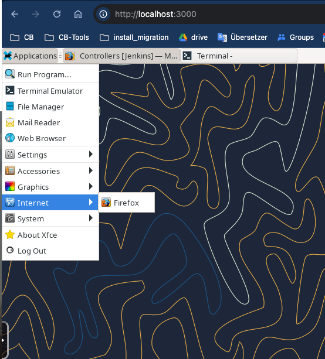

* open `http://oc.ha`

### Option2_Use_your_browser_on_your_docker_host

* Add the following to your `/etc/hosts` file

> 127.0.0.1 localhost oc.ha controller.ha

* Then open Firefox/Chrome on your PC: [http://oc.ha](http://oc.ha)
* Optional (if you can not resolve the hostnames): Flush the DNS cache (MacOs)

> sudo dscacheutil -flushcache; sudo killall -HUP mDNSResponder

## Open the Operations Center

* Point the browser to http(s)://$OC_URL  (by default this is <http://oc.ha/>)
* (Not required when using CasC) Unlock the Operations Center, you will find the key in the docker-compose logs on your console
* (Not required when using CasC) You can use this command to get the password

```
docker-compose exec operations-center   cat /var/jenkins_home/secrets/initialAdminPassword
```

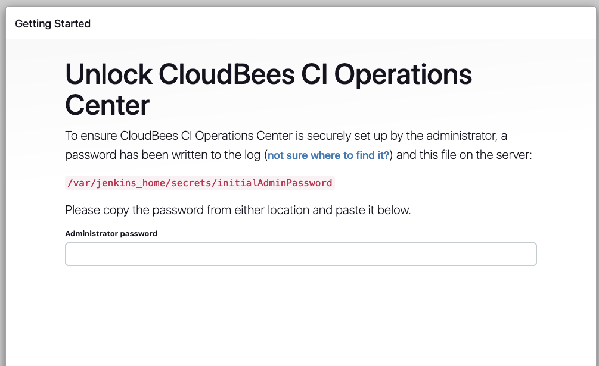

* Request a license and add admin user details
* (Not required when using CasC)  Install the suggested Plugins
* (Not required when using CasC)  Under Operations Center -> Manage Jenkins -> Security
  * Disable TCP Port 50000 (we don't need it, all traffic in this demo is HTTP or SSH)

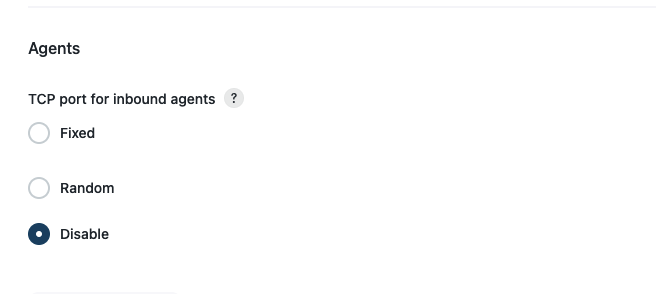

* (Not required when using CasC) Enforce Security realm and SSO

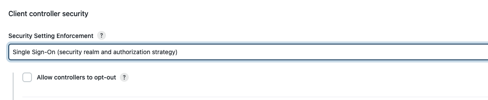

## Create a client controller item

* (Not required when using CasC) In the Operations Center, create a client controller item.
* (Not required when using CasC) Ensure you have "websocket" enabled in the connection configuration

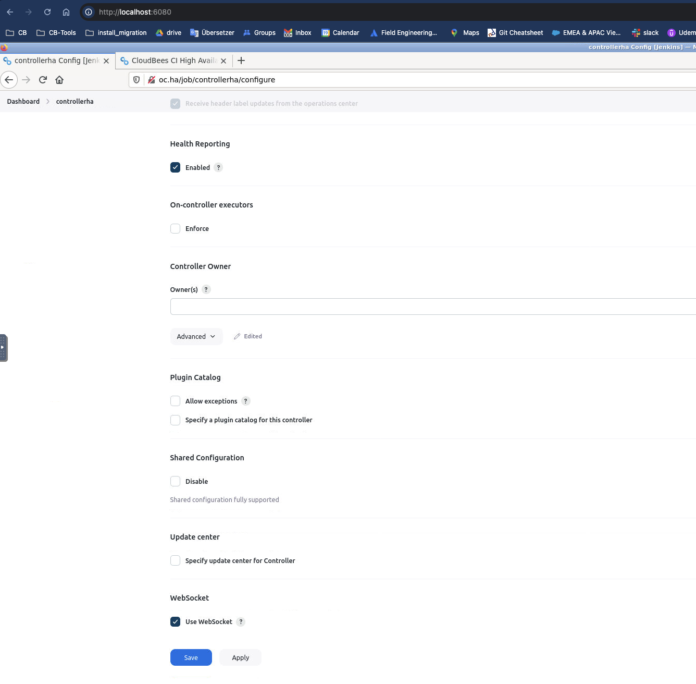
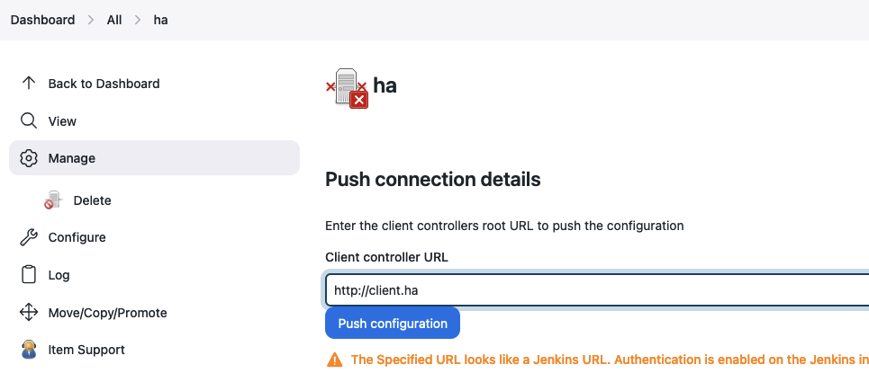
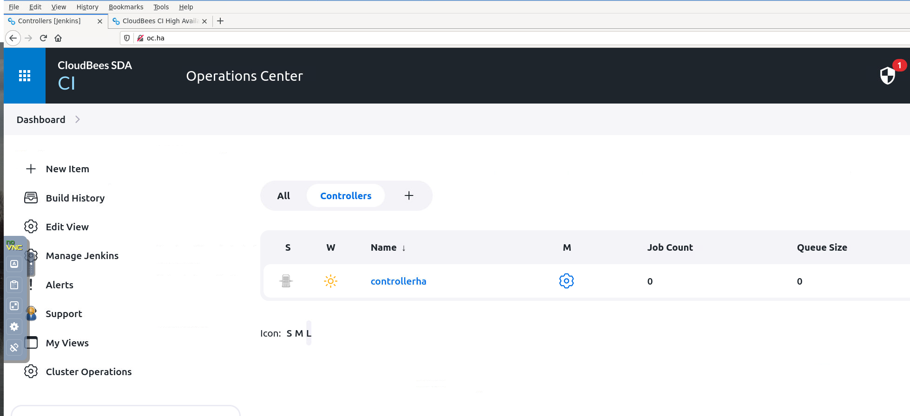

* Required: Push the configuration to http://$CLIENTS_URL  (by default this is <http://controller.ha/> )
  * Not required: Try to access http://$CLIENTS_URL/ in Firefox
  * Not required: Request a license and add admin user details
* (Not required when using CasC) Get the Controller1 initial password

> docker-compose exec ha-client-controller-1    cat /var/jenkins_home/secrets/initialAdminPassword

* (Not required when using CasC) Install HA plugin (active/active) on http://$CLIENTS_URL/

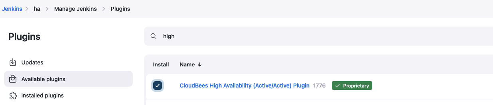

* (Not required when using CasC)The two replicas must be restarted.

  ```
  ./restartControllers.sh
  ```

or

  ```
  docker-compose restart ha-client-controller-1
  docker-compose restart ha-client-controller-2
  ```

* Controller 2 will begin starting when Controller 1 is ready
* It takes some minutes now, you can see the HA status in the controllers' Manage Jenkins section

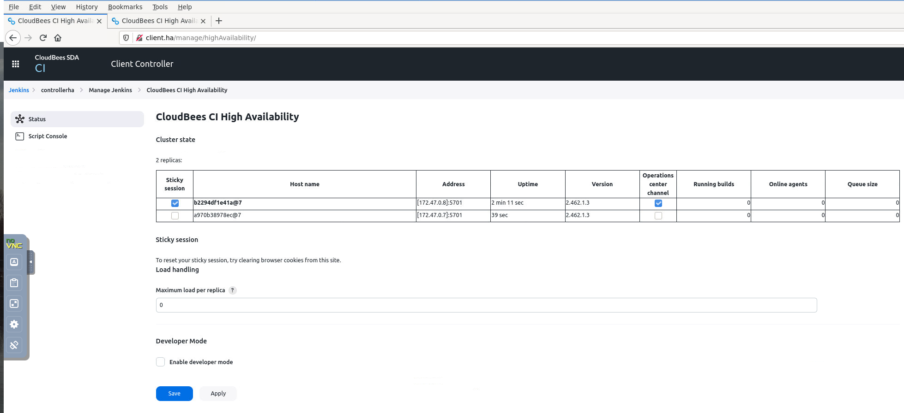

## On the controller: Create a jenkins ssh credential

Note: Not required when using CasC

Join the Controller and add an SSH Credentials (private key)

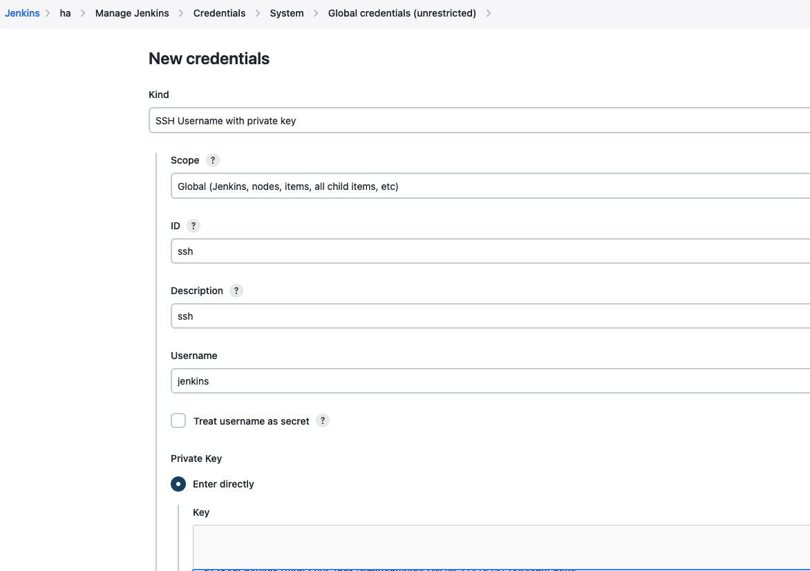

### Optional, if you don't have an ssh key: Create a key pair

`ssh-keygen -t rsa -f ~/.ssh/id_rsa`

Adjust the path to the ssh key in the `env.sh` file

> export JENKINS_AGENT_SSH_PUBKEY=$(cat ~/.ssh/id_rsa.pub)

or

> export JENKINS_AGENT_SSH_PUBKEY=$(cat <YOUR_PATH_HERT>/agent-key.pub)

Use the private part in the Controller when defining credentials to connect to the agent.
Choose credentials with username and private key. Username is jenkins.

## Create a SSH Agent Node

Note: Not required when using CasC

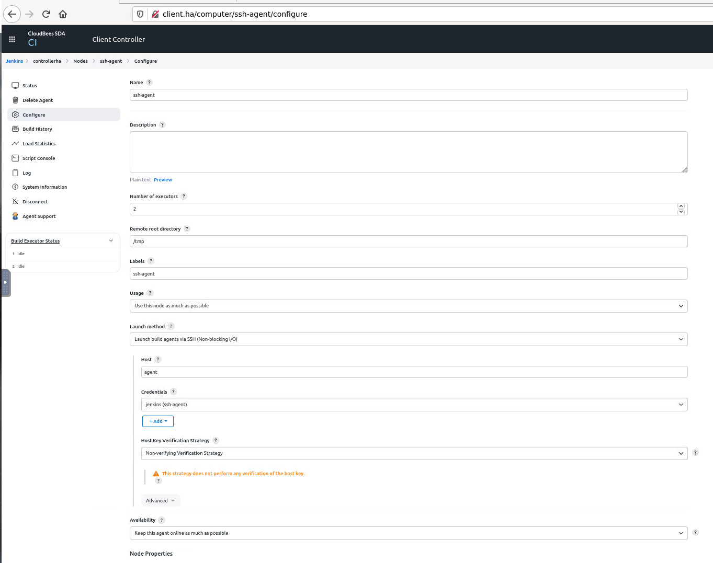

## Create a test Pipeline

Note: Not required when using CasC

Once the SSH Agent has been created you can create a simple Test Pipeline on the HA Controller

[test/Jenkinsfile-ssh-agent.groovy](test/Jenkinsfile-ssh-agent.groovy)

Once the Pipeline is started you can  demo one replica to demo the build will take over to the other replica and continues to run if the controller replica is shut down

* Start the Pipeline
* Check what replica you are running on
* Enable HA developer mode to show the info icon to the bottom of the Controller
* This also shows you the IP address of your session replica
* shut your controller replica down (see in `docker-compose.yaml` for the IP address mapped to the docker container name)

```
docker-compose stop ha-client-controller-1 # or ha-client-controller-2 depending on where you are 
```

* Reload the Controller page in your browser, you should now be on the other replica and the job should resume working

# Troubleshooting

## Browser shows Site is not secured/Missing SSL Certificate

We run on localhost, an SSL certificate is not part of the demo now.
If you hit SSL issues in your browser when you access the Operations center, do the following:

### Disable "HTTPS Only" mode

* <https://docs.cloudbees.com/docs/cloudbees-ci/latest/troubleshooting/install-ha-active-active#_troubleshoot_cloudbees_ci_on_traditional_platforms_installations>

## Reconnect Controllers to CJOC

* <https://docs.cloudbees.com/docs/cloudbees-ci-kb/latest/operations-center/how-do-i-reconnect-a-controller-to-joc-after-changing-joc-to-https#_if_client_controller_is_not_accessible_from_the_ui>

## Curl to inspect headers

To show only headers using a GET request (with no body):

```
source ./env.sh
curl -u ${CJOC_LOGIN_USER}:${CJOC_LOGIN_PW} -s -D - ${CLIENTS_URL} -o /dev/null
curl -u ${CJOC_LOGIN_USER}:${CJOC_LOGIN_PW} -s -D - ${CJOC_URL} -o /dev/null
```

To get both the headers and body of the response:
Use the -v (verbose) option or -i (include headers in the output):

```
source ./env.sh
curl -u ${CJOC_LOGIN_USER}:${CJOC_LOGIN_PW} -i -v  ${CLIENTS_URL} -o /dev/null
curl -u ${CJOC_LOGIN_USER}:${CJOC_LOGIN_PW} -i -v  ${CJOC_URL} -o /dev/null
```

Send custom host header

```
source ./env.sh
curl -u ${CJOC_LOGIN_USER}:${CJOC_LOGIN_PW}  -v -H "Host: custom.example.com" ${CLIENTS_URL} -o /dev/null
curl -u ${CJOC_LOGIN_USER}:${CJOC_LOGIN_PW}  -v -H "Host: custom.example.com" ${CJOC_URL} -o /dev/null
```

## Browser shows SSL issues or side is not secured/Missing SSL Certificate

If you hit SSL issues in your browser when you access the Operations Center, do the following:

### Option:-When-using-self-singed-certificate-(HTTPS-mode)

To make the certificate trusted in your browser:

* [Add the certificate to your Keychain Access](https://support.apple.com/guide/keychain-access/add-certificates-to-a-keychain-kyca2431/mac)
* Import the certificate into MacOs "Keychain Access"
* Once imported: click the certificate and select  "Always trusted"


### Option: When not using self signed certificates: Disable "HTTPS Only" mode

If you hit SSL cert issues in your browser, do the following:

(Haven't checked yet how to do this in Chrome, if required)

* As the demo HAProxy doesn't support HTTPS/SSL yet, we use Firefox with disabled `HTTPS only mode` see <https://support.mozilla.org/en-US/kb/https-only-prefs>

Under Firefox settings search "HTTPS Only"

Disable HTTPS only:

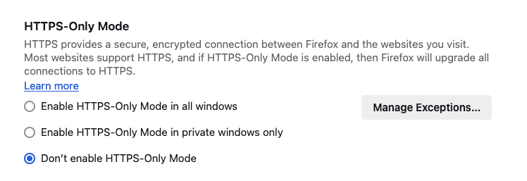

Add exceptions:

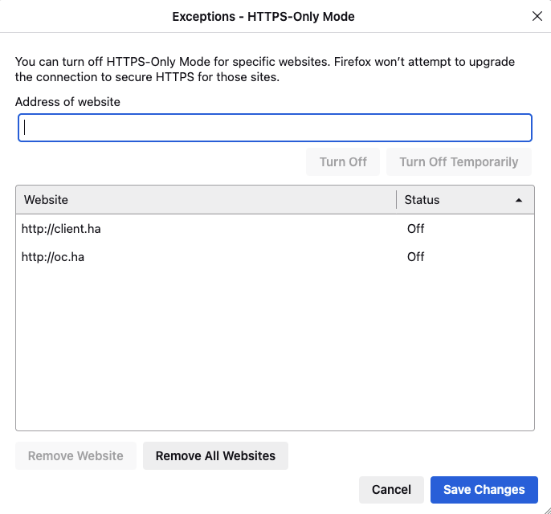

# Extra Notes used during development of the demo (Not required for the setup)

## DNS Flush (MacOs)

> sudo dscacheutil -flushcache; sudo killall -HUP mDNSResponder

## Useful Docker commands

### Inspect network

```
docker network ls
docker network inspect traditional-ha_demo-network
```

### Restart container

```
docker-compose restart <container>
```

Example:

```
docker-compose restart ha-client-controller-1
docker-compose restart ha-client-controller-2
```

### List docker processes

```
docker-compose top
```

## Details SSH Agents

### Create your ssh keys

> ssh-keygen -t rsa -b 2048 -C "<your_email@example.com>"

### Add your public key to the agent container

add the ssh-pub key in your `docker-compose.yaml` file

```
    environment:
      - JENKINS_AGENT_SSH_PUBKEY="YOUR_PUB_KEY"

```

Restart the agent container if required

> docker-compose restart agent

Verify if the key has been applied: (Join the docker agent container and check the `/home/jenkins/.ssh` directory)

# Links

References we have used for the development of this demo environment:

* <https://docs.cloudbees.com/docs/cloudbees-ci/latest/ha/specific-ha-installation-traditional>
* <https://docs.cloudbees.com/docs/cloudbees-ci/latest/ha/ha-considerations>
* <https://www.cloudbees.com/blog/analyzing-cloudbees-ci-high-availability-performance-bottlenecks-and>
* [docs/HAProxy/1_Using_SSL_Certificates_with_HAProxy.pdf](ssl/1_Using_SSL_Certificates_with_HAProxy.pdf)
* <https://www.haproxy.com/blog/haproxy-configuration-basics-load-balance-your-servers>
* <https://www.haproxy.com/documentation/haproxy-configuration-manual/latest/>
* <https://www.haproxy.com/documentation/haproxy-configuration-tutorials/load-balancing/websocket/#configure-websockets>
* <https://www.haproxy.com/documentation/haproxy-configuration-tutorials/core-concepts/backends/>
* <https://docs.docker.com/compose/networking/>
* <https://www.claudiokuenzler.com/blog/900/how-to-use-docker-host-ip-address-inside-application-container>
* <https://eventuate.io/docs/usingdocker.html>
* <https://docs.linuxserver.io/images/docker-webtop/#lossless-mode>
* <https://daniel.haxx.se/blog/2022/03/24/easier-header-picking-with-curl>
* <https://www.tonmann.com/2017/11/12/running-jenkins-with-ssl-on-default-https-port/>

# TODO and next steps

* [ ] Test/update to run on Linux (whatever)
* [ ] Verify to introduce NFS
* [ ] Consider to replace [docker-compose.yaml.template](docker-compose.yaml.template) with <https://docs.docker.com/reference/compose-file/interpolation/>
* [x] Enable SSL on HAPRoxy (self-signed certs?)
