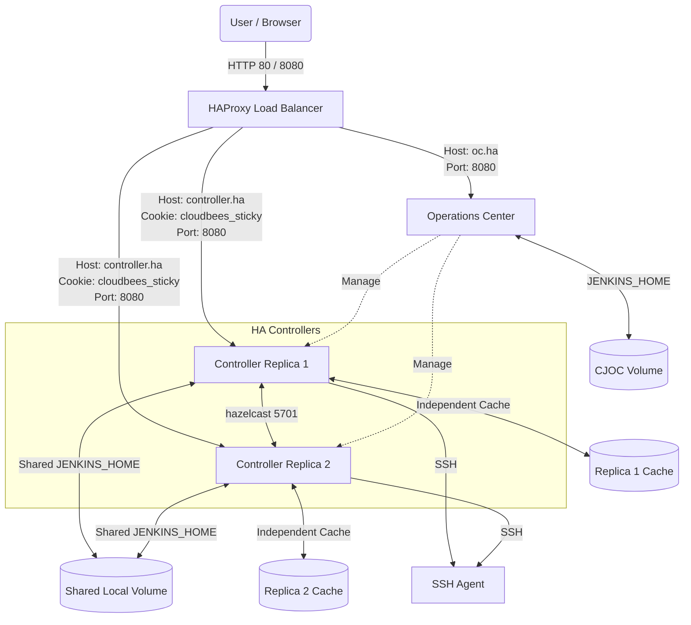
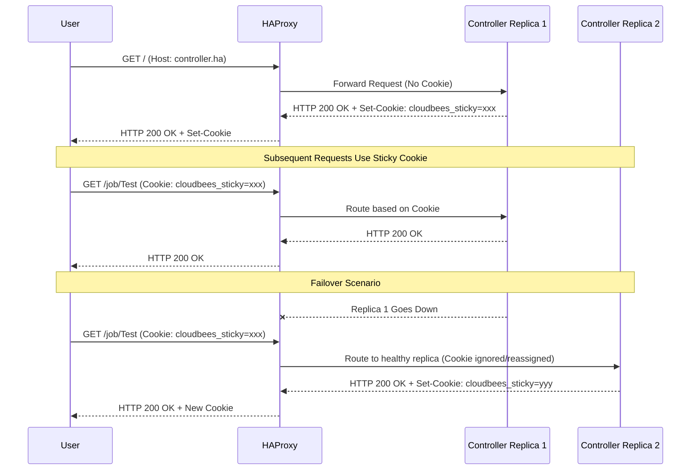
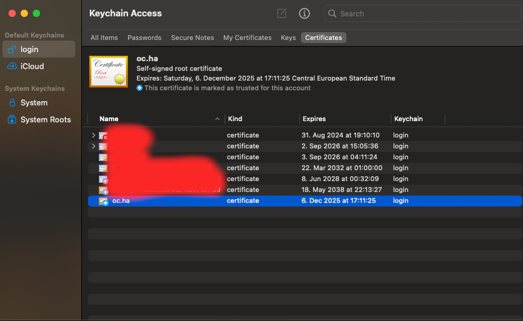
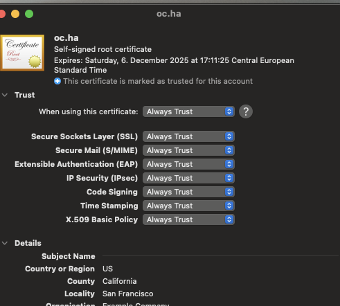

# CloudBees CI Traditional HA (Active/Active) Demo Lab

A complete Docker Compose environment demonstrating a [CloudBees CI Traditional Installation](https://docs.cloudbees.com/docs/cloudbees-ci/latest/traditional-install-guide/) running in [High Availability (Active/Active) mode](https://docs.cloudbees.com/docs/cloudbees-ci/latest/ha/ha-fundamentals).

For more background on CloudBees CI High Availability, refer to the [Resources](#resources) section at the bottom of this document.

# Infrastructure Components

The lab features the following containers:

* **HAProxy Reverse Proxy:** Routes traffic to CJOC and Controllers. Uses `$OC_URL` host header for Operations Center requests and `$CONTROLLER_URL` for controller requests (with sticky session balancing).
* **Operations Center (CJOC):** Central CloudBees CI management component.
* **Controllers (2x):** Run in HA/HS (Active/Active) mode. (HS is not realy part of the lab)
* **SSH-Agent (1x):** Agent container for running pipeline builds.
* **Webtop (Optional):** A containerized Linux desktop with standard web browsers for accessing the lab.

# Prerequisites

The demo has been verified with:

* **OS:** macOS 14.7
* **Docker Desktop:** 4.24.0 (Engine: 24.0.6)
* **Docker Compose:** v2.22.0-desktop.2
* **Browsers:** Firefox, Google Chrome
* **CloudBees CI:** 2.541.1.35570

# Architecture

This demonstration orchestrates CloudBees components and an HAProxy load balancer using Docker Compose. It operates self-sufficiently without requiring configuration on the Docker host, with two exceptions:

1. **Persistence:** Local host directories are mapped as persistent volumes. (NFS is not used in this lab; Controller 1 and Controller 2 share the same `$JENKINS_HOME` directory via a local mount.)
2. **Browser Access:** Hostnames must be resolved either via `/etc/hosts` or by using the included containerized browser (accessible via [http://localhost:3000](http://localhost:3000)).

**Current Limitations:**

* NFS support is not yet implemented. Local directories are used instead.

## HTTP Mode (Port 80 / 8080)



## HTTPS Mode (Port 443 / 8443)


## Request Flow



# Quick Start

1. **Clone the Repository:** Check out the source code to your local machine.
2. **Launch the Lab:**
   * HTTP Mode: `./up.sh`
   * HTTPS Mode: `./up.sh ssl=true`

   *This script scaffolds local volumes, generates SSH keys, creates a self-signed SSL certificate (if using HTTPS), renders the Compose file via `envsubst`, and starts all containers. Configuration as Code (CasC) provisions the initial setup.*
3. **Access the Lab:**
   Wait for components to initialize, then choose an access method:
   * **Option A (Browser in a Box):** Navigate to [http://localhost:3000](http://localhost:3000) and launch a Browser. No host configuration required.
   * **Option B (Local Browser):** Add `127.0.0.1 localhost oc.ha controller.ha` to your `/etc/hosts` file and open [http://oc.ha](http://oc.ha) or [https://oc.ha](https://oc.ha) depending on the mode.
4. **Log In:** Use `admin / admin` to log into the Operations Center.

You will find a controller running in HA mode with a pre-configured SSH agent and a test pipeline job ready to execute.

# Operations and Maintenance

| Action | Command | Description |
|--------|---------|-------------|
| **Start Environment** | `./up.sh` (or `./up.sh ssl=true`) | Initializes volumes, config, and starts containers. |
| **Stop Environment** | `./down.sh` | Safely stops all containers. |
| **Rolling Restart Controllers** | `./test/controllersRollingRestart.sh` | Performs a rolling restart of the HA controllers. |
| **Rolling Upgrade Controllers** | `./test/controllersRollingUpgrade.sh` | Performs a rolling upgrade of the HA controllers. |
| **Clean Up** | `./cleanUp.sh` | Deletes the docker persistence directories on the host. |

## Restart container

```
docker-compose restart <container>
```

Example:

```
docker-compose restart ha-client-controller-1
docker-compose restart ha-client-controller-2
```

# File Reference

* **[`.env`](.env) and [`.env-ssl`](.env-ssl):** Contains essential variables (`OC_URL`, `CONTROLLER_URL`, image versions, HA parameters). Standard use cases do not require modification.
* **[`docker-compose.yaml`](docker-compose.yaml):** docker-compose configuration.
* **[`docker-compose.ssl.yaml`](docker-compose.ssl.yaml):** docker-compose overlay configuration for HTTPS mode.
* **[`up.sh`](up.sh):** Primary utility script to start the lab.
* **[`down.sh`](down.sh):** Primary utility script to stop the lab.
* **[`cleanUp.sh`](cleanUp.sh):** Hard reset script to drop persistence volumes.
* **[`ssl/01-createSelfSigned.sh`](ssl/01-createSelfSigned.sh):** Generates keys and certificates required for HTTPS mode.
* **`secrets/`:** Auto-generated directory containing SSH keys injected into Controllers by CasC.
* **`test/`:** Contains test scripts and utilities. (Need to be updated/validated)
* **[`haproxy.cfg`](haproxy.cfg) / [`haproxy-ssl.cfg`](haproxy-ssl.cfg):** HAProxy configurations defining frontends, backends, health checks, sticky sessions, and websockets.
* **[`casc/cjoc/`](casc/cjoc/):** Bundles used to provision the Operations Center on startup.
* **[`casc/controller/`](casc/controller/):** Bundles to configure the HA controllers (includes HA plugin settings, SSH credentials, agent configs, and standard test jobs).

# Testing High Availability

1. Ensure both controllers are running and verify their status via the HA monitor screen.
2. Trigger the SSH Agent Pipeline [`http://controller.ha/job/testpipeline/`](http://controller.ha/job/testpipeline/) on the controller (pre-created already by [controller casc items](casc/controller/items.yaml)).
3. Identify which replica is actively running your session (enable HA developer mode to see the info icon at the bottom of the UI).
4. Shut down the active replica: `docker-compose stop ha-client-controller-1` (or `2`, validate before which is your active session).
5. Reload your browser; the operation should seamlessly failover to the healthy replica, and the pipeline will continue execution.

See also [test/README.md](test/README.md) for more information.

# Troubleshooting

See also [CloudBees HA/HS troubleshooting](https://docs.cloudbees.com/docs/cloudbees-ci/latest/troubleshooting/install-ha-active-active#_troubleshoot_cloudbees_ci_on_traditional_platforms_installations)

## SSL Certificate Warnings

Because the demo uses self-signed certificates or runs without SSL locally, browsers may show security warnings.

If you hit SSL issues in your browser when you access the Operations Center, do the following:

To make the certificate trusted in your browser:

* [Add the certificate to your Keychain Access](https://support.apple.com/guide/keychain-access/add-certificates-to-a-keychain-kyca2431/mac)
* Import the certificate into MacOs "Keychain Access"
* Once imported: click the certificate and select  "Always trusted"





## DNS Issues (macOS)

If you cannot resolve `oc.ha` or `controller.ha` after modifying `/etc/hosts`, flush the DNS cache:

```bash
sudo dscacheutil -flushcache; sudo killall -HUP mDNSResponder
```

## Hazelcast Networking

If the active/active nodes fail to pair:

1. Remove `-Dhz.jet.enabled=true` if it appears in JVM arguments.
2. Verify port connectivity between replicas: `nc -vz <CONTROLLER_IP> 5701`.
3. Confirm configured IPs for `-Dhudson.TcpSlaveAgentListener.hostName`.
4. Enable Hazelcast debug logging: add `-Dhazelcast.diagnostics.enabled=true` to JVM options and configure a custom logger for `com.cloudbees.jenkins.plugins.replication.hazelcast.FilesystemDiscoveryStrategy`.

## Reconnect Controllers to CJOC

* <https://docs.cloudbees.com/docs/cloudbees-ci-kb/latest/operations-center/how-do-i-reconnect-a-controller-to-joc-after-changing-joc-to-https#_if_client_controller_is_not_accessible_from_the_ui>

## Curl to inspect headers

To show only headers using a GET request (with no body):

```
source .env
source .env.ssl # if using ssl
curl -u ${CJOC_LOGIN_USER}:${CJOC_LOGIN_PW} -s -D - ${CONTROLLER_URL} -o /dev/null
curl -u ${CJOC_LOGIN_USER}:${CJOC_LOGIN_PW} -s -D - ${CJOC_URL} -o /dev/null
```

To get both the headers and body of the response:
Use the -v (verbose) option or -i (include headers in the output):

```
source .env
source .env.ssl # if using ssl
curl -u ${CJOC_LOGIN_USER}:${CJOC_LOGIN_PW} -i -v  ${CONTROLLER_URL} -o /dev/null
curl -u ${CJOC_LOGIN_USER}:${CJOC_LOGIN_PW} -i -v  ${CJOC_URL} -o /dev/null
```

Send custom host header

```
source .env
source .env.ssl # if using ssl
curl -u ${CJOC_LOGIN_USER}:${CJOC_LOGIN_PW}  -v -H "Host: custom.example.com" ${CONTROLLER_URL} -o /dev/null
curl -u ${CJOC_LOGIN_USER}:${CJOC_LOGIN_PW}  -v -H "Host: custom.example.com" ${CJOC_URL} -o /dev/null
```

## Inspect network

```
docker network ls
docker network inspect traditional-ha_demo-network
```

## List docker processes

```
docker-compose top
```

# Resources

See links below for further details

## CloudBees CI High Availability

* [Traditional HA Installation Guide](https://docs.cloudbees.com/docs/cloudbees-ci/latest/ha/specific-ha-installation-traditional)
* [HA Fundamentals](https://docs.cloudbees.com/docs/cloudbees-ci/latest/ha/ha-fundamentals)
* [HA Considerations](https://docs.cloudbees.com/docs/cloudbees-ci/latest/ha/ha-considerations)
* [HA Performance Bottlenecks & Tuning](https://www.cloudbees.com/blog/analyzing-cloudbees-ci-high-availability-performance-bottlenecks-and)

## HAProxy & Networking

* [HAProxy Websocket Load Balancing Configuration](https://www.haproxy.com/documentation/haproxy-configuration-tutorials/load-balancing/websocket/#configure-websockets)
* [HAProxy Core Concepts - Backends](https://www.haproxy.com/documentation/haproxy-configuration-tutorials/core-concepts/backends/)
* [HAProxy Configuration Basics - Load Balance Your Servers](https://www.haproxy.com/blog/haproxy-configuration-basics-load-balance-your-servers)
* [HAProxy Configuration Manual](https://www.haproxy.com/documentation/haproxy-configuration-manual/latest/)
* [Using SSL Certificates with HAProxy (PDF)](ssl/1_Using_SSL_Certificates_with_HAProxy.pdf)
* [Docker Compose Networking](https://docs.docker.com/compose/networking/)
* [How to use Docker host IP address inside an application container](https://www.claudiokuenzler.com/blog/900/how-to-use-docker-host-ip-address-inside-application-container)
* [Using Docker for testing](https://eventuate.io/docs/usingdocker.html)

## Other tools

* [LinuxServer.io Webtop Container Documentation](https://docs.linuxserver.io/images/docker-webtop/#lossless-mode)
* [Easier header picking with curl](https://daniel.haxx.se/blog/2022/03/24/easier-header-picking-with-curl)
* [Running Jenkins with SSL on default HTTPS port](https://www.tonmann.com/2017/11/12/running-jenkins-with-ssl-on-default-https-port/)

## Roadmap / TODO

* [x] Ensure full support and testing on standard Linux distributions.
* [ ] Implement and verify NFS-backed volume sharing.
* [x] Enable SSL on HAProxy (Self-signed certificates).
